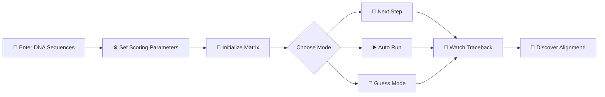

<div align="center">

# 🧬 Local Alignment Game

### _Where Bioinformatics Meets Fun!_

[](https://alizayan684.github.io/Bioinformatics-Games/)
[](https://developer.mozilla.org/en-US/docs/Web/HTML)
[](https://developer.mozilla.org/en-US/docs/Web/CSS)
[](https://developer.mozilla.org/en-US/docs/Web/JavaScript)

**An interactive educational game that brings the Smith-Waterman algorithm to life!**

</div>

---

## 🎯 What's This About?

<div align="center">


</div>

This game demonstrates how **local sequence alignment** works in bioinformatics to find regions of similarity between DNA sequences. 

Unlike **global alignment** (Needleman-Wunsch), which forces entire sequences to align end-to-end, **local alignment** discovers the best matching subsequences without requiring full-length alignment—perfect for finding conserved domains or motifs!

---

## ✨ Features

<table>
<tr>
<td width="50%">

### 🎮 Interactive Learning
- **Step-by-step visualization** - Watch the scoring matrix build cell by cell
- **Auto-run mode** - Sit back and observe the algorithm in action
- **Guess Mode** - Test your knowledge by predicting cell values before they're revealed

</td>
<td width="50%">

### 🎨 Visual Excellence
- **Color-coded matrix** - Instantly identify current position, max scores, and optimal paths
- **Traceback animation** - See exactly how the optimal alignment path is discovered
- **Celebration effects** - Enjoy confetti explosions when you guess correctly! 🎉

</td>
</tr>
<tr>
<td width="50%">

### ⚙️ Customization
- **Adjustable scoring** - Fine-tune match scores, mismatch penalties, and gap penalties
- **Custom sequences** - Input your own DNA sequences or use provided examples
- **Real-time updates** - See changes reflect immediately in the matrix

</td>
<td width="50%">

### 📱 Accessibility
- **Single HTML file** - No installation required, just open in any browser
- **Mobile-friendly** - Responsive design works seamlessly on phones and tablets
- **Zero dependencies** - Pure HTML, CSS, and JavaScript - works offline!

</td>
</tr>
</table>

---

## 🚀 Quick Start

<div align="center">

### [▶️ Play the Game Now!](https://alizayan684.github.io/Bioinformatics-Games/)

</div>

### How to Play



1. **Enter two DNA sequences** (or use the default examples)
2. **Configure scoring parameters**:
   - Match score (typically +2 to +3)
   - Mismatch penalty (typically -1 to -3)
   - Gap penalty (typically -2 to -5)
3. Click **"Initialize Matrix"** to set up the grid
4. Choose your learning mode:
   - 👣 **Next Step** - Advance one cell at a time
   - ▶️ **Auto Run** - Watch the complete algorithm execution
   - 🤔 **Guess Mode** - Challenge yourself by predicting values
5. Observe the **traceback** to discover the optimal local alignment!

---

## 🧬 The Science Behind It

<div align="center">


*_"When you finally understand local alignment"_*

</div>

The **Smith-Waterman algorithm** (1981) is a dynamic programming approach for local sequence alignment:

| Key Principle | Description |
|--------------|-------------|
| 🔢 **Scoring Matrix** | Each cell represents the best alignment score ending at that position |
| 🚫 **No Negatives** | Negative scores are reset to zero, allowing alignment to restart |
| 🏝️ **Score Islands** | Positive score clusters represent regions of similarity |
| 🎯 **Maximum Score** | The highest value identifies the best local alignment starting point |
| ↩️ **Traceback** | Path reconstruction from max score to zero reveals the optimal alignment |

### Mathematical Formula

For each cell `(i, j)` in the matrix:

```
H(i,j) = max {
    0,                              // Reset negative scores
    H(i-1, j-1) + s(aᵢ, bⱼ),       // Diagonal (match/mismatch)
    H(i-1, j) - gap,               // Up (gap in sequence B)
    H(i, j-1) - gap                // Left (gap in sequence A)
}
```

Where `s(aᵢ, bⱼ)` is the match score if characters match, or mismatch penalty otherwise.

---

## 🛠️ Technical Details

- **File Structure**: Single `index.html` file containing all HTML, CSS, and JavaScript
- **Browser Support**: Works on all modern browsers (Chrome, Firefox, Safari, Edge)
- **Responsive Design**: Adapts to screen sizes from mobile phones to desktop monitors
- **Performance**: Optimized for sequences up to 50 characters without lag

---

## 📚 Educational Use Cases

Perfect for:
- 🎓 **Bioinformatics courses** - Visual aid for teaching sequence alignment
- 🔬 **Research labs** - Quick demonstration tool for students
- 💻 **Self-learning** - Interactive way to understand dynamic programming
- 🏫 **Classroom activities** - Engaging homework or in-class exercises

---

## 🌟 Credits & Inspiration

Created as an educational tool to make bioinformatics concepts accessible and engaging.

**Algorithm Reference**: Smith, T.F. & Waterman, M.S. (1981). "Identification of common molecular subsequences". *Journal of Molecular Biology*. 147: 195-197.

---

<div align="center">

### 🧪 Ready to Align?

[](https://alizayan684.github.io/Bioinformatics-Games/)

**Happy aligning!** May your matches be plenty and your gaps be few. 🧬✨

---

<p align="center">Made with ❤️ for bioinformatics enthusiasts worldwide</p>

</div>
